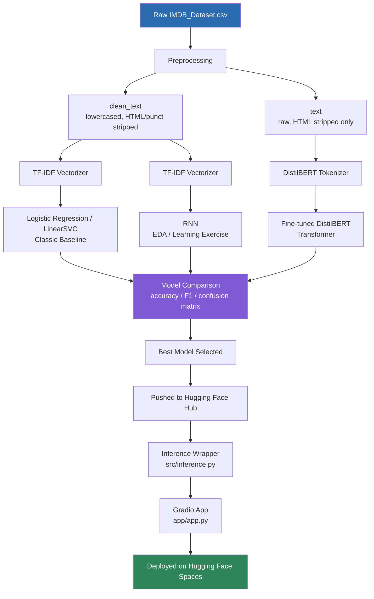
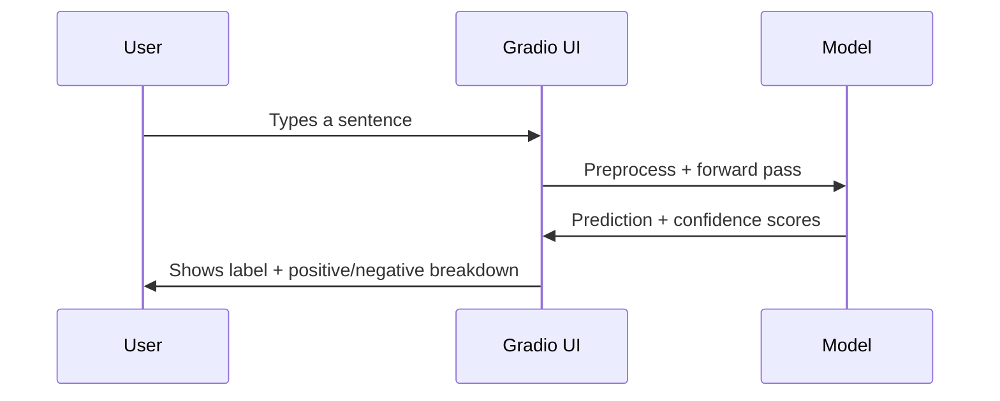

## Architecture for Sentimeter

```mermaid
flowchart TD
    A[Raw IMDB_Dataset.csv] --> B[Preprocessing]
    B --> C1[clean_text\nlowercased, HTML/punct stripped]
    B --> C2[text\nraw, HTML stripped only]

    C1 --> D1[TF-IDF Vectorizer]
    D1 --> E1[Logistic Regression / LinearSVC\nClassic Baseline]

    C1 --> D2[TF-IDF Vectorizer]
    D2 --> E2[RNN\nEDA / Learning Exercise]

    C2 --> D3[DistilBERT Tokenizer]
    D3 --> E3[Fine-tuned DistilBERT\nTransformer]

    E1 --> F[Model Comparison\naccuracy / F1 / confusion matrix]
    E2 --> F
    E3 --> F

    F --> G[Best Model Selected]
    G --> H[Pushed to Hugging Face Hub]
    H --> I[Inference Wrapper\nsrc/inference.py]
    I --> J[Gradio App\napp/app.py]
    J --> K[Deployed on Hugging Face Spaces]

    style A fill:#2b6cb0,color:#fff
    style K fill:#2f855a,color:#fff
    style F fill:#805ad5,color:#fff
```

**Inference flow (deployed app):**

```mermaid
sequenceDiagram
    participant U as User
    participant UI as Gradio UI
    participant M as Model

    U->>UI: Types a sentence
    UI->>M: Preprocess + forward pass
    M->>UI: Prediction + confidence scores
    UI->>U: Shows label + positive/negative breakdown
```
