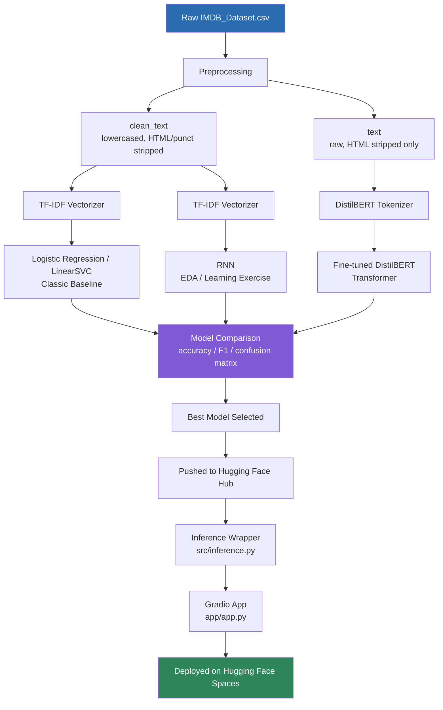
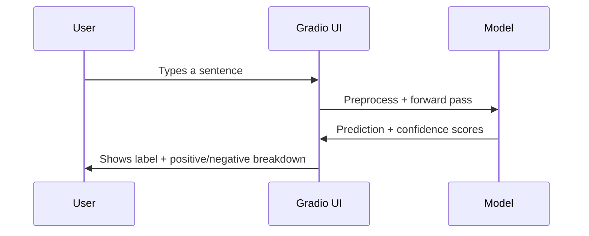

# Sentimeter - Text Sentiment Analysis

[](https://www.python.org/)
[](LICENSE)
[](https://huggingface.co/spaces/PRIYANSHU2025/sentimeter)

An end-to-end sentiment analysis project on the IMDB movie reviews dataset - from raw CSV to a deployed demo - built as a learning resource as much as a working app

**[Try the live demo →](https://huggingface.co/spaces/PRIYANSHU2025/sentimeter)**

---

## Overview

This project classifies text as **positive** or **negative** sentiment, built as a deliberate progression:

1. **Classic ML baseline** - TF-IDF + Logistic Regression/LinearSVC. Fast, interpretable, no GPU needed
2. **RNN experiment** - a from-scratch PyTorch RNN, kept as a learning exercise on sequence model mechanics (see the notes in that notebook about why TF-IDF input limits what an RNN can actually learn)
3. **Fine-tuned transformer** - DistilBERT, fine-tuned on the same data for a meaningful accuracy jump over the baselin
4. **Deployment** - the best model served behind a Gradio UI on Hugging Face Spaces

## [Architecture](Architecture.md)



**Inference flow (deployed app):**



## Project Structure

```
sentiment-analyzer/
├── app/
│   ├── app.py                      # Gradio UI — entry point for the deployed app
│   └── requirements.txt            # dependencies for running the app
├── data/
│   ├── raw/
│   │   └── IMDB_Dataset.csv        # original dataset (not committed — see Getting Started)
│   └── processed/
│       ├── train.csv               # generated by src/preprocess.py
│       └── test.csv
├── models/
│   ├── logreg_sentiment.pkl        # trained classic baseline
│   └── tfidf_vectorizer.pkl        # fitted TF-IDF vectorizer
├── notebooks/
│   ├── EDA with RNN.ipynb          # RNN exploration / learning exercise
│   └── finetune_distilbert.ipynb   # Colab notebook for transformer fine-tuning
├── src/
│   ├── __init__.py
│   ├── preprocess.py               # cleaning, dedup, train/test split
│   ├── train_classic.py            # TF-IDF + LogReg / LinearSVC training
│   └── inference.py                # unified inference wrapper (classic or transformer backend)
├── .gitignore
├── LICENSE
└── README.md
```

## Tech Stack

| Layer | Tools |
|---|---|
| Data handling | pandas, scikit-learn |
| Classic ML | TF-IDF, Logistic Regression, LinearSVC |
| Deep learning | PyTorch (RNN), Transformers (DistilBERT) |
| Model hosting | Hugging Face Hub |
| App / UI | Gradio |
| Deployment | Hugging Face Spaces (ZeroGPU) |
| Training compute | Google Colab (T4 GPU) for the transformer fine-tune |

## Prerequisites

- **Python 3.10+**
- **pip** (comes with Python)
- **git**
- A **Hugging Face account** (free) if you want to push models or deploy your own Space - not required just to run things locally
- **No GPU required** for the classic baseline or running the app. A GPU (or free Colab) is only needed if you want to fine-tune DistilBERT yourself

## Getting Started

### 1. Clone the repository

```bash
git clone https://github.com/your-username/sentimeter.git
cd sentimeter
```

### 2. Create a virtual environment

```bash
python -m venv venv

# activate it:
source venv/bin/activate        # macOS / Linux
venv\Scripts\activate           # Windows (PowerShell or cmd)
```

### 3. Install dependencies

```bash
pip install -r app/requirements.txt
```

### 4. Get the dataset Source

 Download it from Kaggle: [IMDB Dataset of 50K Movie Reviews](https://www.kaggle.com/datasets/lakshmi25npathi/imdb-dataset-of-50k-movie-reviews)

```
data/raw/IMDB_Dataset.csv
```

## Usage

### Preprocess the data

```bash
python src/preprocess.py
```
### Train the classic baseline

```bash
python src/train_classic.py
```

### Run the app locally

```bash
python app/app.py
```

Open the local URL Gradio prints (typically `http://127.0.0.1:7860`). By default it uses the classic model. To use a fine-tuned transformer instead:

```bash

# Windows (PowerShell)
$env:SENTIMENT_BACKEND="transformer"
$env:HF_REPO="your-username/distilbert-sentiment-imdb"
python app/app.py
```

## Results

| Model | Accuracy | F1 | Notes |
|---|---|---|---|
| TF-IDF + Logistic Regression | 91.0% | 0.911 | Baseline, trains in minutes on CPU |
| TF-IDF + LinearSVC | 90.8% | 0.909 | Comparable to LogReg |
| RNN (TF-IDF input) | — | — | Learning exercise — see the notebook for why this architecture choice limits what the RNN can actually learn from bag-of-words input |
| Fine-tuned DistilBERT | *pending* | *pending* | Update after running the fine-tuning notebook |
---

## License

MIT - see [](LICENSE) for details

## Acknowledgments

[](https://huggingface.co/spaces/PRIYANSHU2025/sentimeter)

- Dataset: [IMDB Movie Reviews](https://ai.stanford.edu/~amaas/data/sentiment/) (Maas et al., 2011)
- Model: [DistilBERT](https://huggingface.co/distilbert-base-uncased) (Sanh et al., 2019)
- Built with [Gradio](https://www.gradio.app/) and deployed on [Hugging Face Spaces](https://huggingface.co/spaces)

---
